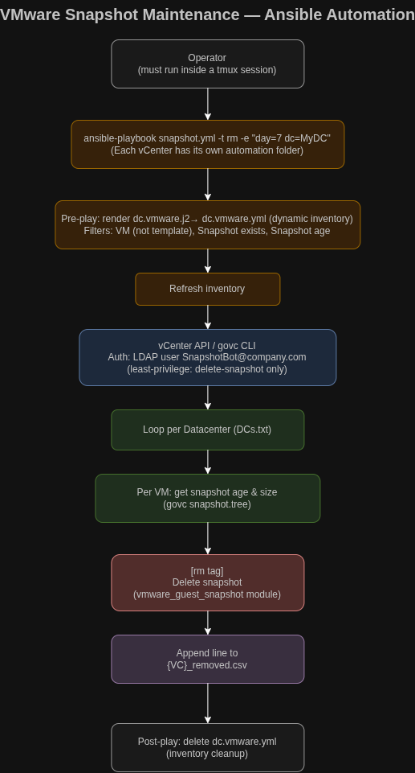
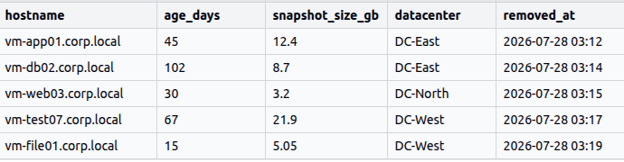

# VMware Snapshot Deletion Automation
Delete VMs snapshots through the vCenter with Ansible

## 🚀 Overview
This automation solves the operational risks caused by unmanaged VMware snapshots across multiple datacenters.

In large vSphere environments, snapshots are often created for maintenance or troubleshooting and then forgotten. Over time, they consume datastore space, degrade VM performance, extend backup windows, and can even cause datastore exhaustion or VM connectivity issues.

The Ansible playbook automates the identification, reporting, and removal of snapshots older than a defined retention threshold (for example 7, 15, 60, or 180 days). It dynamically builds inventory per datacenter, calculates snapshot age, retrieves snapshot size (using `govc`), and either generates reports or removes outdated snapshots.

By enforcing a retention policy, reducing manual effort, and producing audit-friendly reports, this automation minimizes storage bloat and operational risk while keeping snapshot management consistent and controlled at scale.

## 💥 Real-World Impact

This automation was created to address a high-impact operational issue in large-scale environments: oversized and long-lived snapshots on database VMs.

In the most critical cases, snapshot growth caused database VMs to become unavailable. Application and development teams could not connect to their databases, leaving multiple teams blocked until the issue was identified and resolved.

Resolving these incidents required deleting the oversized snapshot and consolidating the VM disks. Depending on the size of the VM and the snapshot chain, these operations could take anywhere from approximately 6 hours to 3 days to complete. During that time, affected teams could remain unable to access critical database services, while infrastructure teams had to closely monitor the recovery process.

By proactively identifying and removing aged snapshots, this automation delivered measurable operational and business benefits:

* **Improved VM performance:** Reduced the performance impact caused by large, long-running snapshots, especially on high-demand database VMs.
* **Reduced storage expansion:** Eliminated the recurring need to add datastore capacity simply to accommodate unmanaged snapshot growth.
* **Reclaimed approximately 300 TB:** Recovered about **300 TB of storage capacity** during the first large-scale implementation.
* **Prevented snapshot-related outages:** Helped prevent incidents where bloated snapshots caused database connectivity issues and service disruption.
* **Saved thousands of developer hours:** Reduced the time developers spent waiting for database access and incident resolution.
* **Reduced infrastructure team workload:** Prevented avoidable escalations, manual cleanup work, and prolonged incident response efforts.

*Instead of reacting to storage exhaustion and VM degradation after they affect users, teams can enforce a consistent snapshot-retention policy and address risk before it becomes an outage.*

### Key Features
*   **Aged Cleanup:** Deletes snapshots exceeding a defined `day` threshold.
*   **Automated Reporting:** Generates CSVs of existing snapshots and **Accumulated deletion logs**.
*   **Dynamic Inventory:** Builds vCenter inventory on-the-fly from templates (`dc.vmware.j2`).
*   **Session Management:** Requires an active `tmux` session to prevent job interruption.
*   **Least privilege approach** A dedicated LDAP user with single permission (delete VM snapshot) was created for this automation.

## 🛠 Prerequisites
*   **Ansible Core:** v2.15.8+
*   **Govc CLI:** Must be installed and in `$PATH`.
*   **Credentials:** LDAP user `SnapshotBot@company.com`.

## 📖 Usage Examples

### 📊 Reporting (report tag)

Generate a CSV report of snapshots older than 7 days (Single DC):
```bash
ansible-playbook -t report  -e "day=7 dc=ILRNA_BSS_DC"  snapshot.yml
```

Generate a CSV report of snapshots older than 15 days for all datacenters listed in `DCs.txt`:
```bash
for DC in $(<DCs.txt) ; do 
  ansible-playbook -t report -e "day=15 dc=$DC" snapshot.yml 
done
```

### 🗑️ Snapshot Deletion (rm tag)

Delete snapshots older than 7 days (Single DC)
```bash
ansible-playbook -t rm -e "day=7 dc=ILRNA_BSS_DC" snapshot.yml
```

Delete Snapshots Older Than 60 Days for all datacenters listed in `DCs.txt`:
```bash
for DC in $(<DCs.txt); do
  echo "Processing $DC"
  ansible-playbook -t rm -e "day=60 dc=$DC" snapshot.yml
done
```
#### Deletion workflow



#### Sample deletion report (with descriptive header line)



